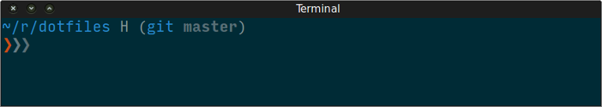
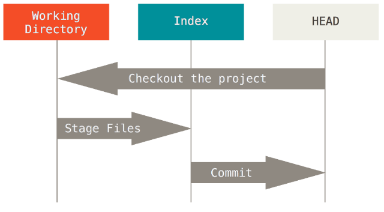

class: center, middle

# Git Recommended Uses

### Practices to get comfortable using and learning Git

### Javier Tiá / August 26, 2015

---

## Who am I to talk about Git?

* Using Git professionally since 2011.

--

* Developed tools around Git: repo tool, WSSW Git Hooks and various little
utilities.

--

* Migrated severals projects to Git from Clearcase, CVS and Subversion.

--

* Solved hundreds of issues helping people using Git. Today I still do it, but
 no hundreds 😊.

---

## Expectations

* I expect from this presentation you can take some knowledge and apply it to
your frequent Git routine.

---

## Why 'Git Recommended Uses' presentation?

1. People struggle while are learning Git.

--

2. Git is a powerful tool, but it has some hard hills to climb.

--

3. At the beginning poor documentation and severals ways to get same result.

--

4. Git is not Subversion.

???

1. By experience I have seen many smart people struggle while are learning Git.
Some people compare Git with Hitler.

2. When are too many options, usually you get confused.

3. With each Git release the documentation is getting better, but still are the
options to get same result..

4. Git redefined how to use a Control Version software and the world was used
to Centralized approach. It's not Subversion, but it can be used similar.

---

## Little Git History

* Created in 2005 by Linus Torvalds and maintained today by Junio Hamano.

--

* Meaning 'git' as word: unpleasant person.

--

* Git arrived as a necessity.

???

* Created 10 years ago, patches and many contributors and thousands contributions.

* Torvalds said: "I'm an egotistical bastard, and I name all my projects after
myself. First 'Linux', now 'git'."

* After close accesses of Linux kernel developers to BitKeeper (SCM). Torvalds
released the first Git version and the world of Control Version software
started to change.

---

## Why Git and no another SCM

.center[]

???

* Git won SCM war.

* When Torvalds designed Git, he already has experience with BitKeeper in the big
Linux Kernel code base. He studied all defects of CVS, Subversion, Darcs,
Baazar, Monotone and others.

* Be distributed, simple designed, making quickly and clean merges, all together
was a big deal on that time.

---

## How to self-study Git?

* Mindset: Think Git as you are exploring a tree.

--

* Get started with:

  * http://try.github.io/

  * http://gitimmersion.com/

  * http://git-scm.com/book/

--

* Complement always with:

  * `git help <COMMAND>` || `git help --all` || `git help --guides`

--

  * Making questions with a Web searcher.

--

  * Practice in a terminal.

???

Problem to solve:

> How to learn Git by your self?

Show hints commands to probe Git is a Tree

With Internet: show the training sites

Show how it works all `git help` commands.

Make an example how to practice in terminal.

---

## Use latest stable Git version

Assuming Ubuntu as Distribution.

> $ sudo add-apt-repository ppa:git-core/ppa

> $ sudo apt-get update

> $ sudo apt-get install git

???

Problem to solve:

> Ubuntu has a Git version is not updated frequently.

Normally, people has fears to update software due to avoid a 'possible'
breakdown system. Others are just lazy people. Git code has a strong Test Suite
with thousands test cases.

In all these years using Git, I have never lost information for update to the
latest stable Git version.

---

## Get a better CLI prompt



https://github.com/nojhan/liquidprompt

???

Problem to solve:

> Know where are you while you're using Git in CLI

---

## Identify yourself

Remember now you are an author. Identify yourself:

> $ git config --global user.name "__YOUR NAME__"

> $ git config --global user.email "__YOUR EMAIL ADDRESS__"

???

Problem to solve:

> Identify your commits with a proper authorship

Remember now you are an author.

---

## Increase Git usability by leveraging *.gitconfig*

> Set per repository or global options.

> Use `git config` to Get, Set and Unset options.

> Don't forget look for more details: `git help config`.

???

Problem to solve:

> Teach how to take advantage of .gitconfig file

Show how to Get, Set and Unset Git options.

---

## Git Reset/Checkout

.center[]

???

Problem to solve:

> Understand how `git reset` and `git checkout` works.

Mention use of `git reset --patch`

---

## Common Git aliases

> $ git config --global alias.br branch

> $ git config --global alias.ci commit

> $ git config --global alias.co checkout

> $ git config --global alias.st status

> $ git config --global alias.ls ls-files

> $ git config --global alias.rb rebase

> $ git config --global alias.mg merge

???

Problem to solve:

> Reduce keystrokes

Where you're using Git, you will type commands more than you could imagine.

If you're looking yourself typing a command more than two times, you should
thinking to create an alias.

---

## How to write a commit message

Structure of a commit message:

> Subject line<br/>
> _BLANK LINE_<br/>
> Body message

--

 Rules:

1. Write subject line thinking: What am I doing?

--

2. Use imperative mood in subject line: no -ing, -ed.

--

3. Do not end subject line with a period.

--

4. Limit subject line between 50 to 70 characters.

--

5. Insert a blank line between subject line and body message.

--

6. Write body message thinking: Why am I doing it? vs How am I doing it?

--

7. Limit body message to 72 characters.

???

Problem to solve:

> People write commit messages without care about it.

If you find yourself struggling and thinking too much about your commit, it
could be is too long all changes. Make it shorter.

If it's too much rules, consider a good editor as helper, e.g.: Vim.

Mention to install fit-commit

```sh
$ gem install fit-commit
```

Every commit should respond to this question: "When applied, this commit will:"

---

## Use Interactive mode to commit

Interactively choose hunks between the index and the work tree and add them to
the index:

> $ git add --patch

--

It gives the user a chance to review the changes before commit them.

--

Consider use a shell alias:

> $ alias giA='git add --patch'

???

Problem to solve:

> People gets confuse about how to commit changes

Interactively choose hunks between the index and the work tree and add them to
the index.

---

## Merge vs Rebase

One of most controversial Git discussions, just search: Merge vs Rebase.

--

Know when use _merge_ or _rebase_ add significant added value. It produces a
clean and semantically correct history graph.

--

 Rules:

1. Work always with topic or temporal branches, avoid work over master or
features branches.

--

2. Use `git merge` when incorporating an entire feature set into another branch,
use `git rebase` for rest of cases.

--

3. Golden rule: Never use `git rebase` over published changes, only over new
and no pushed changes.

???

Problem to solve:

> Extended confusion about when to use `git merge` or `git rebase`.

Clarify rebase concept. Show it in next slide.

---

## Rebase concept

.center[]

---

## Keep clean and correct Git history

\* Always rebase your local commits and preserve all merges:

> $ git config --global pull.rebase preserve

> _Require Git v1.8.5+_

--

\* For merging features and avoid lose the branch information of which a commit
was originally made:

git | git config (Permanent) | git config (Just to master)
:---:|:---:|:---:
merge | merge.ff | branch.master.mergeoptions
--no-ff FEATURE | false | --no-ff

--

\* For merging fixes use --ff-only to fast-forward:

git | git config (Permanent) | git config (Just to master)
:---:|:---:|:---:
merge | merge.ff | branch.master.mergeoptions
--ff-only FIX | only | --ff-only

???

Problem to solve:

> How to keep a clean and correct Git history.

Clarify fast-forward merges.

---

## Resolving conflicts

`--ours` option: current branch changes checked out.

`--theirs` option: changes coming in via merge or rebase.

--

Normal way:

> $ git checkout --ours/--theirs &lt;FILE&gt;

> $ git add &lt;FILE&gt;

--

Using alias:

> $ git config --global alias.our = ours = "!f() { \

> &nbsp; &nbsp;git checkout --ours $@ && git add $@; }; f"

> $ git ours &lt;FILE&gt;

--

For repeated resolution of conflicts:

> $ git config --global rerere.enabled true

???

Problem to solve:

> How to deal with conflict without using a Editor.

Explain issues with '<<<<<<', '>>>>>>' or '======' in an Editor.

---

## Rebase interactive

It allows to navigate for each commit deciding interactively what to do.

> $ git rebase -i

--

You can pick (or delete), reword commit message, edit code, squash, fixup or exec an
command.

--

Automatically modify the rebase todo list:

> $ git config --global rebase.autoSquash true

???

Problem to solve:

> How to modify commits

Clarify about pick, reword, edit, squash (merge commit message) and fixup
(discard commit message) in rebase todo list.

---

## Switch context at will

Saves local modifications and produce a clean state:

> $ git stash

--

Allows to switch context to solve issues like: fix a local commit, checkout
another branch and more.

--

Prevent unwanted deletions from `git reset --hard/--merge`.

--

If stashed changes will live a long time, name it:

> $ git stash save 'NAME MESSAGE'

--

Don't forget to look in `git help stash` for further details.

???

Problem to solve:

> Lose changes when you want to switch anoter branch or use `git reset
--hard/--merge`

Talk about `git stash list/show/drop/pop/clear/apply`

---

## Git clean

Remove recursively files that are not under version control. Files like:
generated by build system.

--

Prevent unwanted deletion by running first:

> $ git clean -n

It shows all files would be removed.

--

Look in `git help clean` for further details.

???

Problem to solve:

> Delete unwanted files

Talk about `git clean` options.

---

## Useful little recommendations

Add color helpers to read text easier and see what Git is doing:

> $ git config --global color.ui true

--

Copy/move a file in an one commit. Git doesn't difference between removing
files and changes in it.

???

Problem to solve:

> Reading huge walls of text can be difficult.
> Clarify when a file was removed.

---

## References

* This presentation: https://github.com/jetm/git-recommended-uses/

* Presentation made with: http://remarkjs.com/

## Contact information

* javier.tia@gmail.com / javier.tia@hpe.com

---

class: center, middle

# Questions?

---

class: center, middle

# Backup slides

---

## Protect bare/server repositories

No rewriting history:

> $ git config receive.denyNonFastForwards true

No deleting history:

> $ git config receive.denyDeletes true

Check object consistency:

> $ git config receive.fsckObjects true

???

Problem to solve:

> Rewrite history and lose information.
